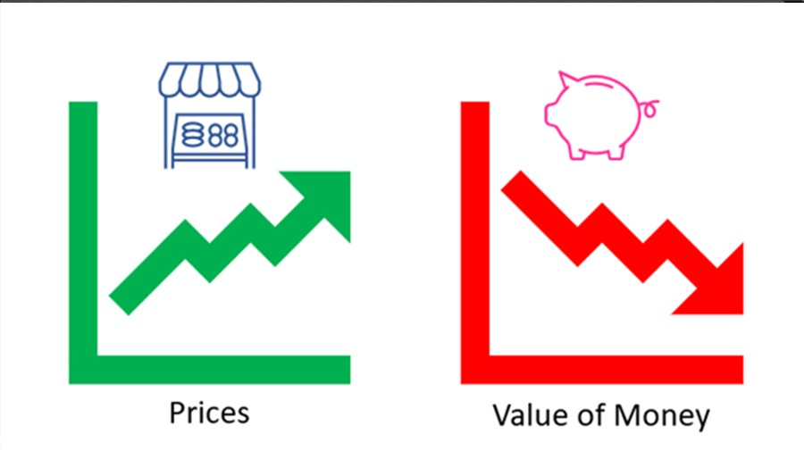

<!-- PROJECT LOGO -->
<br />
<p align="center">
  <a href="https://github.com/MADS-MarisaRivera/Predicting-Inflation">
    
  </a>

  <h3 align="center">Predicting Inflation</h3>

  <p align="center">
    Data Products Creation & Deployment - Final Project
    <br />
    <a href="https://github.com/MADS-MarisaRivera/Predicting-Inflation"><strong>Explore the docs »</strong></a>
    <br />
  </p>
</p>


<!-- TABLE OF CONTENTS -->
<details open="open">
  <summary>Table of Contents</summary>
  <ol>
    <li>
      <a href="#about-the-project">About The Project</a>
      <ul>
        <li><a href="#built-with">Built With</a></li>
      </ul>
    </li>
    <li>
      <a href="#getting-started">Getting Started</a>
      <ul>
        <li><a href="#prerequisites">Prerequisites</a></li>
        <li><a href="#installation">Installation</a></li>
      </ul>
    </li>
    <li><a href="#usage">Usage</a></li>
  </ol>
</details>


<!-- ABOUT THE PROJECT -->
## About The Project



According to <a href="http://www.banguat.gob.gt/page/inflacion-total">Banco de Guatemala</a>, nowadays, **Guatemala is reporting a 3.82% inflation at July2021**, which is 0.94pp more than last year at July2020. At this point, it is important to enhance than inflation will always exist in our society, people has to learn to live with it. However, if we look at the definition of inflation itself:
<br/>
"<a href="https://www.investopedia.com/terms/i/inflation.asp">Inflation</a> is the decline of purchasing power of a given currency over time. A quantitative estimate of the rate at which the decline in purchasing power occurs can be reflected in the increase of an average price level of a basket of selected goods and services in an economy over some period of time. The rise in the general level of prices, often expressed as a percentage, means that a unit of currency effectively buys less than it did in prior periods."
<br/> 
<br/> 
In other words, inflation makes us feel that we can't afford as much as we could than last year, mostly, when our incomes remain static from one year to another. This is why, companies and customers, must be open-eyed when it comes to inflation, because it has a direct impact in their purchasing power.
<br/> 
<br/> 
Therefore, as a team of passionate members about analytics, we are seeking to predict the porcentual variance, between next month inflation value and its last years value, meaning -12 months, so that we can anticipate to increasing inflation or decreasing inflation (deflation) periods. 
For example, when we predict deflation periods, we may promote in our companies & personal expenses, the perks of deflation, and buy more for less or, save the remaining money that we didn't spend in our regular purchases. 
<br/> 
<br/> 
*This is how, we learn to coexist with inflation behavior, in a way that we can also take the most of it when it's behavior moves on our favor.*


### Built With

* [Python](https://www.python.org)
* [Shap](https://shap.readthedocs.io/en/latest/index.html)
* [Bayesian Ridge Regression](https://scikit-learn.org/stable/auto_examples/linear_model/plot_bayesian_ridge.html)


<!-- GETTING STARTED -->
## Getting Started

Follow this instructions to setup project.

### Prerequisites
* [python3.8 or later](https://www.python.org/downloads/)
* **shap**
  ```sh
  pip install shap
  ```
* **flask**
  ```sh
  pip install flask
  ```  
* **pandas**
  ```sh
  pip install pandas
  ```
* **numpy**
  ```sh
  pip install numpy
  ```
* **sklearn**
  ```sh
  pip install sklearn
  ```  
* **joblib**
  ```sh
  pip install joblib
  ```   
* **requests**
  ```sh
  pip install requests
  ```
* **json**
  ```sh
  pip install json
  ```
* **prettytable**
  ```sh
  pip install prettytable
  ```


### Installation

1. Clone the repo
   ```sh
   git clone https://github.com/MADS-MarisaRivera/Predicting-Inflation.git
   ```
2. Install Python 3.8 or later and Libraries
3. Run this:
   ```sh
   *linea de comando para correr modelo*
   ```

<!-- USAGE EXAMPLES -->
## Usage

Use this space to show useful examples of how a project can be used. Additional screenshots, code examples and demos work well in this space. You may also link to more resources.

_For more examples, please refer to the [Documentation](https://example.com)_
