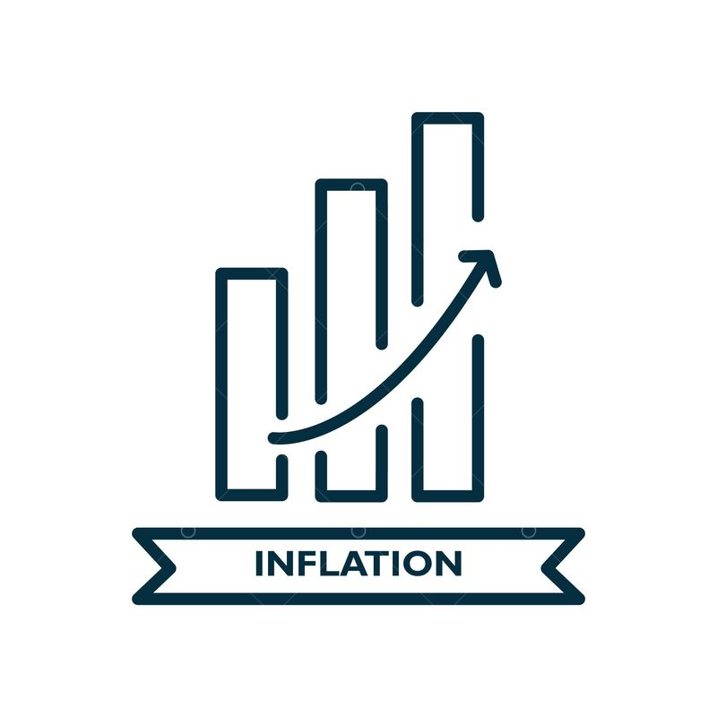
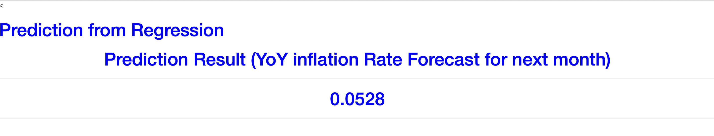

<!-- PROJECT LOGO -->
<br />
<p align="center">
  <a href="https://github.com/MADS-MarisaRivera/Predicting-Inflation">
    
  </a>

  <h3 align="center">Predicting Inflation</h3>

  <p align="center">
    Data Products Creation & Deployment - Final Project
    <br />
    <a href="https://github.com/MADS-MarisaRivera/Predicting-Inflation"><strong>Explore the docs »</strong></a>
    <br />
  </p>
</p>


<!-- TABLE OF CONTENTS -->
<details open="open">
  <summary>Table of Contents</summary>
  <ol>
    <li>
      <a href="#about-the-project">About The Project</a>
      <ul>
        <li><a href="#built-with">Built With</a></li>
      </ul>
    </li>
    <li><a href="#dataset-inputs">Dataset Inputs</a></li>
    <li>
      <a href="#getting-started">Getting Started</a>
      <ul>
        <li><a href="#prerequisites">Prerequisites</a></li>
        <li><a href="#installation">Installation</a></li>
      </ul>
    </li>
    <li><a href="#usage">Usage</a></li>
  </ol>
</details>


<!-- ABOUT THE PROJECT -->
## About The Project

According to <a href="http://www.banguat.gob.gt/page/inflacion-total">Banco de Guatemala</a>, nowadays the country is reporting a 3.82% inflation at July2021, which is 0.94pp more than last year at July2020. At this point, it is important to enhance that inflation will always exist in our society, and that people have to learn to live with it. However, if we look at the definition of inflation itself:
<br/>
"<a href="https://www.investopedia.com/terms/i/inflation.asp">Inflation</a> is the decline of purchasing power of a given currency over time. A quantitative estimate of the rate at which the decline in purchasing power occurs can be reflected in the increase of an average price level of a basket of selected goods and services in an economy over some period of time. The rise in the general level of prices, often expressed as a percentage, means that a unit of currency effectively buys less than it did in prior periods."
<br/> 
<br/> 
In other words, inflation makes us feel that we can't afford as much as we could last year, mostly, when our incomes remain static from one year to another. This is why companies and customers must be open-eyed when it comes to inflation, because it has a direct impact on their purchasing power. 
<br/> 
<br/> 
Therefore, as a team of passionate members about analytics, **we are seeking to predict the percentual variance, between next month's inflation value and its last year's value, meaning 12 months earlier, so that we can anticipate increasing inflation or decreasing inflation (deflation) periods.** 
For example, when we predict deflation periods, we may promote in our companies & personal expenses, the perks of deflation, and buy more for less or, save the remaining money that we didn't spend in our regular purchases.
<br/> 
<br/> 
*We believe this is how we learn to coexist with inflation behavior, in a way that we can also take the most of it when it's behavior moves in our favor.*


### Built With

* [Python](https://www.python.org)
* [Shap](https://shap.readthedocs.io/en/latest/index.html)
* [Bayesian Ridge Regression](https://scikit-learn.org/stable/auto_examples/linear_model/plot_bayesian_ridge.html)
* [Flask](https://flask.palletsprojects.com/en/2.0.x/)
* [PythonAnywhere](https://www.pythonanywhere.com)


<!-- DATASET -->
## Dataset Inputs
* [Data Source (JSON Output)](https://www.bls.gov/developers/api_python.htm#python1)
  ```sh
  import requests
  import json
  import prettytable
  import pandas as pd 
  headers = {'Content-type': 'application/json'}
  data = json.dumps({"seriesid": ['SUUR0000SA0'],"startyear":"2012", "endyear":"2021"})
  p = requests.post('https://api.bls.gov/publicAPI/v1/timeseries/data/', data=data, headers=headers)
  json_data = json.loads(p.text)
  for series in json_data['Results']['series']:
      cols=["series id","year","period","value","footnotes"]
      x=pd.DataFrame(columns = cols)
      seriesId = series['seriesID']
      for item in series['data']:
          year = item['year']
          period = item['period']
          value = item['value']
          footnotes=""
          for footnote in item['footnotes']:
              if footnote:
                  footnotes = footnotes + footnote['text'] + ','

          if 'M01' <= period <= 'M12':
              x.append([seriesId,year,period,value,footnotes])
  ```
* Raw Data Sample
  ```
  {'status': 'REQUEST_SUCCEEDED',
   'responseTime': 230,
   'message': [],
   'Results': {'series': [{'seriesID': 'SUUR0000SA0',
      'data': [{'year': '2021',
        'period': 'M07',
        'periodName': 'July',
        'latest': 'true',
        'value': '153.424',
        'footnotes': [{'code': 'I', 'text': 'Initial'}]},
       {'year': '2021',
        'period': 'M06',
        'periodName': 'June',
        'value': '152.720',
        'footnotes': [{'code': 'U', 'text': 'Interim'}]},
       {'year': '2021',
        'period': 'M05',
        'periodName': 'May',
        'value': '151.405',
        'footnotes': [{'code': 'U', 'text': 'Interim'}]},
       {'year': '2021',
        'period': 'M04',
        'periodName': 'April',
        'value': '150.221',
        'footnotes': [{'code': 'U', 'text': 'Interim'}]}
  ]}]}}
  ```
* Model Input - Data Preparation Sample
    - series id: key
    - year: year
    - period: month
    - value: price index
    - footnotes: attached features
    - value-1: value from last month
    - value-3: value from 3 months ago
    - value-6: value from 6 months ago
    - value-12: value from 12 months ago
    - var-1: percentual delta from value and value-1
    - var-3: percentual delta from value and value-3
    - var-6: percentual delta from value and value-6
    - var-12: percentual delta from value and value-12

  | series id | year | period | value | footnotes | value-1	| value-3	| value-6 | value-12 | var-1 | var-3 | var-6 | var-12 | var-1_lag | var-3_lag	| var-6_lag	| var-12_lag |
  | --- | --- | --- | --- | --- | ---	| ---	| --- | --- | --- | --- | --- | --- | --- | ---	| ---	| --- |
  | SUUR0000SA0	| 2021 | M07 | 153.424 | Initial | 152.720 | 150.221 | 147.123 | 145.747 | 0.004610 | 0.021322 | 0.042828 | 0.052673 | 0.008685 |	0.025049 | 0.042621 | 0.054354 |
  | SUUR0000SA0	| 2021 | M06 | 152.720 | Interim | 151.405 | 148.988 | 146.477 | 144.847 | 0.008685 | 0.025049 | 0.042621 | 0.054354 | 0.007882 | 0.023373 | 0.034526 | 0.051292 |
  | SUUR0000SA0	| 2021 | M05 | 151.405 | Interim | 150.221 | 147.947 | 146.352 | 144.018 | 0.007882 | 0.023373 | 0.034526 | 0.051292 | 0.008276 | 0.021057 | 0.025672 | 0.042174 |
  | SUUR0000SA0	| 2021 | M04 | 150.221 | Interim | 148.988 | 147.123 | 146.461 | 144.142 | 0.008276 | 0.021057 | 0.025672 | 0.042174 | 0.007036 | 0.017143 | 0.017559	| 0.028120 |
  | SUUR0000SA0	| 2021 | M03 | 148.988 | Interim | 147.947 | 146.477 | 146.417 | 144.913 | 0.007036 | 0.017143 | 0.017559 | 0.028120 | 0.005601 | 0.010898 | 0.011465	| 0.018968 |


<!-- GETTING STARTED -->
## Getting Started

Follow this instructions to setup project.

### Prerequisites
* [python3.9 or later](https://www.python.org/downloads/)
* **shap**
  ```sh
  pip install shap
  ```
* **flask**
  ```sh
  pip install flask
  ```  
* **pandas**
  ```sh
  pip install pandas
  ```
* **numpy**
  ```sh
  pip install numpy
  ```
* **sklearn**
  ```sh
  pip install sklearn
  ```  
* **joblib**
  ```sh
  pip install joblib
  ```   
* **requests**
  ```sh
  pip install requests
  ```
* **json**
  ```sh
  pip install json
  ```
* **prettytable**
  ```sh
  pip install prettytable
  ```


### Installation

1. Clone the repo
   ```sh
   git clone https://github.com/MADS-MarisaRivera/Predicting-Inflation.git
   ```
2. Make sure to have python and prerequisite libraries installed
3. Open in any Python IDE, file app.py
4. Open terminal window, go to your git repo folder and run this command:
   ```sh
      python app.py
   ```
   
   
5. Go to your browser and explore home, predict & drift endpoints.
6. You may also visit link: [PythonAnywhere Output](http://jrs.pythonanywhere.com) to see model prediction output, if you don't want to clone repo and run app with local resources.
  


<!-- USAGE EXAMPLES -->
## Usage 
* app.route/ & app.route/predict
  * Go to your browser and visit respective domain and port, specified in your terminal window (For example: 192.168.5.45:5000/)
  * Window will display prediction output: which must be interpreted in the following way: prediction output is next month's percentage delta with it's last year    reference (var-12). For example, our model is predicting that in August2021 we'll have an inflation value 5.28% higher than August2020.
  * <br/>
  * 
  * <br/>
  * Another thing to add, is that as you may observe in shap values, we are getting the insight that our target variable is mostly influenced by the percentage variance with price index value present value and the price index value from 3 months ago.
  * <br/> 
  * This is the reason why we develop a simulation tool, where you can create different scenarios percentage deltas from last four months, and send it to our model as an input. 
  * <br/>
  * 
  
* app.route/predict
  * In /predict endpoint, you'll be able to analyze the prediction output from that scenario you just simulate.
* app.route/drift
  * Drift endpoint, is for the user to analyze de deviation from current values and hystoric values. For this, user must have in mind that, the more homogeneous these distributions are, the better. Which also means, more confidence in model output of predicting inflation percentage deltas from one year to another.
  * <br/>
  * 
